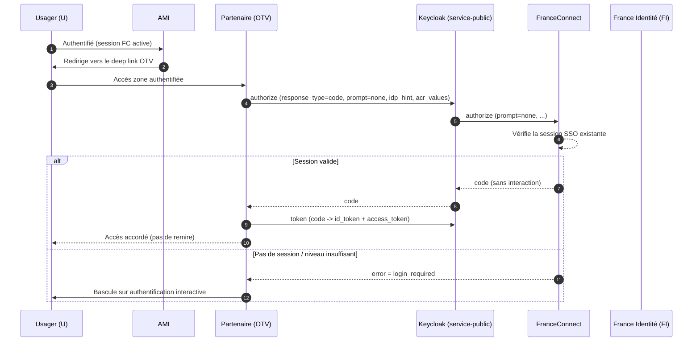
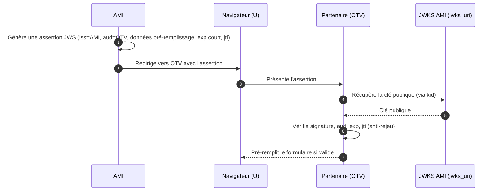

# Proposition d'architecture — « France Connexion Direct »

**Continuité de session SSO inter‑applications et preuve de provenance**

> Document de travail destiné à la discussion avec FranceConnect (FC).
> Statut : proposition — plusieurs points dépendent des capacités et contraintes de FC et sont **à valider avec eux** (voir §6).
> Contexte projet : AMI / service‑public.fr (Keycloak en broker OIDC), partenaire pilote OTV / DILA.

---

## 1. Objet

Permettre à un utilisateur **U**, déjà authentifié dans l'application **AMI** via FranceConnect, d'accéder à une zone authentifiée d'une application **partenaire** (ex. OTV — Opération Tranquillité Vacances, opérée par la DILA) **sans rejouer toute l'authentification**, tout en garantissant au partenaire que la sollicitation **provient bien d'une application de confiance**.

Les deux applications utilisent le **même fournisseur d'identité commun** (FC, via le broker Keycloak `service-public`). C'est le socle qui permet de ne pas réinventer un mécanisme de confiance propriétaire.

---

## 2. Le point clé : ne pas transférer la confiance d'application à application

Le principe directeur, conforme aux standards OAuth 2.0 / OpenID Connect : **le partenaire ne fait pas confiance à AMI directement — il fait confiance à l'émetteur d'identité commun (FC/KC).** C'est précisément la raison d'être d'un fournisseur d'identité partagé.

Cela conduit à séparer **deux problèmes distincts**, qui ont deux réponses différentes et ne doivent pas être mélangés dans un même jeton (erreur identifiée lors de l'intégration PSL/DILA : mélange « pré‑remplissage » et « connexion directe » dans un seul token) :

| # | Problème | Qui porte la confiance | Dépend de FC ? |
|---|----------|------------------------|----------------|
| 1 | **Preuve de provenance** : le partenaire ne répond que si l'appel vient bien d'AMI | Signature de l'émetteur (AMI), vérifiée par le partenaire | Non — entre AMI et partenaires |
| 2 | **Continuité de session SSO** : U arrive authentifié chez le partenaire sans remire | La session SSO FC/KC | **Oui** ou **Non** en fonction de la solution choisie |
| 3 | **Suppression de la page de connexion FC** : l'usager n'a pas besoin de cliquer sur le bouton bleu | tbd | Non - uniquement par le partenaire, si preuve de provenance |
| 4 | **Suppression de la page d'information de FC** : l'usage n'a pas besoin d'être informé, il l'a été au moment de sa connexion sur AMI | tbd | Oui - besoin de déclarer le FS comme étant autorisé à passer prompt=login (toujours si preuve de provenance) |
| 5 | **Préremplissage** : AMI transmets au partenaire des informations dans l'appel : hors scope de ce document | hors scope | hors scope |

Le problème 2 a deux solutions : 
- 2a) une préauthentification chez AMI
- 2b) une préselection du FI AMI-FI par le partenaire

La solution 2a), sans implémenter 3 et 4 permet d'offrir à l'usager, sans développements côté partenaire, une expérience minimale de FranceConnexion longue, où l'usager n'a pas besoin de se connecter aurpès d'un FI tant qu'il passe par AMI et qu'il ne reste pas sur les pages de FranceConnect suffisement longtemps pour invalider le SSO. Y rajouter les point 3, puis 4, supprime ce dernier risque en cachant tout le processus et offre à l'usager une expérience complètement sans couture.

La solution 2b) a l'avantage de mettre les reponsabilités aux bons endroits mais crée une dépendance entre le partenaire et AMI-FI.

---

## 3. Problème 1 — Continuité de session SSO via FC *(à discuter avec FC)*

### 3.1 Approche proposée

Plutôt que de **simuler le clic sur le bouton FranceConnect en JavaScript** (montage actuel, fragile et dépendant de l'UI de FC), le partenaire **déclenche son propre flux OpenID Connect Authorization Code** vers le broker Keycloak, en demandant une **ré‑authentification silencieuse** :

- redirection serveur vers l'`authorize` endpoint du realm `service-public` ;
- paramètre `prompt=none` (pas d'interaction si une session existe) ;
- `idp_hint=france-identite` / `kc_idp_hint=franceconnect-particulier` pour court‑circuiter les écrans de choix ;
- `acr_values` selon le niveau eIDAS requis.

Si une session FC valide existe, FC renvoie un `code` **sans aucune interaction** ; U se retrouve authentifié chez le partenaire. Sinon, FC répond `login_required` et le partenaire **bascule sur l'authentification interactive standard** (comportement de repli déjà prévu par la DILA).

La continuité provient donc de la **session FC/KC**, **pas d'un jeton poussé par AMI**.

### 3.2 Flux nominal (ré‑authentification silencieuse)

### 3.3 Hypothèses à valider avec FC

Tout ce bloc **suppose** des capacités côté FC que nous **ne connaissons pas encore** et qui font l'objet du §6. Le ticket SP‑9729 indiquait notamment que FC **n'avait pas encore déployé** la prise en compte de `prompt` / `idp_hint`.

---

## 4. Problème 2 — Preuve de provenance partenaire *(hors périmètre FC, pour information)*

Ce volet concerne **AMI ↔ partenaires** et **ne sollicite pas FC**. Il couvre **deux interactions distinctes**, qui partagent le même socle cryptographique (JWS + JWKS) mais sont **deux objets différents, portés par deux jetons séparés** — ne jamais les fusionner dans un seul jeton (erreur identifiée lors de l'intégration PSL/DILA).

### 4.0 Vocabulaire — ne pas confondre les objets

| Objet | Qui l'émet | Rôle | Est‑ce notre objet ? | Référence |
|-------|-----------|------|----------------------|-----------|
| **Access token** | Serveur d'autorisation | Accéder à une ressource protégée (présenté en `Bearer` au resource server) | **Non** — ne prouve pas l'origine d'une redirection | RFC 6749 / 9068 |
| **ID token** | IdP (FC / Keycloak) | Attester l'authentification de l'usager | Émis par FC/KC, **pas par AMI** | OIDC Core §2 |
| **Request Object** | AMI (l'app d'origine) | **Signer la *demande* d'autorisation** envoyée au partenaire | **Oui — interaction 1** | OIDC Core §6 / **JAR, RFC 9101** |
| **Assertion (JWT signé)** | AMI (l'app d'origine) | **Transporter des données métier** d'une app à l'autre, avec preuve d'origine | **Oui — interaction 2** | RFC 7519 (conteneur) / RFC 7521 (framework) |
| **Client assertion** (`private_key_jwt`) | AMI | Authentifier l'app A auprès d'un endpoint | Variante back‑channel | RFC 7523 |

**Règles communes aux deux interactions** (corrigent le montage historique « JWT chiffré + certificats partagés à renouveler ») :

- **Signer (JWS), ne pas chiffrer.** La preuve de provenance, c'est la **signature**, pas le chiffrement. La confidentialité sur le fil est assurée par TLS.
- **Publier la clé publique via un `jwks_uri`** (le chemin `/.well-known/jwks.json` est une convention, non normative). Le partenaire récupère la clé seul, la rotation se fait via le `kid` — **plus aucun échange ni renouvellement manuel de certificat**.
- **Jeton restreint** : `iss = AMI`, **`aud = partenaire ciblé`**, `exp` court, `jti` + contrôle anti‑rejeu côté partenaire.
- Le `referrer` HTTP **n'est pas un contrôle de sécurité** (falsifiable) et ne doit pas servir de preuve de provenance.

### 4.1 Interaction 1 — Diriger l'usager vers le partenaire

La confiance d'**authentification** vient de FC/KC (cf. §3) : le partenaire rejoue son flux OIDC, il n'a pas à faire confiance à AMI pour authentifier U. Si l'on veut en plus **garantir l'intégrité et l'origine de la requête de redirection** (paramètres non altérés, demande bien émise par AMI), l'objet adéquat est un **Request Object** : un JWT signé contenant les paramètres de la requête d'autorisation, passé par valeur (`request`) ou par référence (`request_uri`).

> Nom normalisé : **Request Object** — OIDC Core §6 / **JAR (RFC 9101)**. Ce n'est **pas** un access token.

### 4.2 Interaction 2 — Pré‑remplir les formulaires du partenaire

Ici AMI transmet des **données métier** (champs de formulaire, identifiant de démarche) à l'application partenaire. Ce n'est **ni une requête OIDC, ni un access token** : c'est une **assertion signée** (JWT/JWS) qui véhicule les données *et* prouve qu'elles viennent bien d'AMI.

> Nom normalisé : **assertion** (conteneur JWT, RFC 7519 ; framework d'assertions, RFC 7521). Jeton **distinct** de celui de l'interaction 1.

> **Pourquoi JWS + JWKS plutôt que mTLS, à l'échelle « 50 partenaires en 2 ans »** : mTLS impose une PKI bilatérale avec *chaque* partenaire (certificats, révocations, renouvellements). JWS + JWKS = **une** URL publiée que tous les partenaires consomment, rotation automatique.

---

## 5. Ce que nous proposons de retenir

1. Remplacer la **simulation JS du bouton FC** par une **redirection OIDC `prompt=none`** déclenchée par le partenaire (sous réserve du support FC — §6).
2. Repli automatique sur l'**authentification interactive** si la ré‑authentification silencieuse échoue (`login_required`).
3. Pour la provenance partenaire : **JWS + JWKS** (`aud`‑restreint, `exp` court, `jti` anti‑rejeu), avec **deux jetons distincts** — un **Request Object** (JAR / RFC 9101) pour sécuriser la redirection (interaction 1), une **assertion** (JWT, RFC 7519/7521) pour le pré‑remplissage (interaction 2). Pas de chiffrement à certificats partagés, pas de mTLS par défaut, ni d'access token détourné.

---

## 6. Questions à poser à FranceConnect

*(Cœur de la réunion — points dont dépend la faisabilité de la §3, et que nous ne connaissons pas encore.)*

**Session SSO & ré‑authentification silencieuse**
1. FC maintient‑il une **session SSO** permettant une ré‑authentification **silencieuse via `prompt=none`** ? Quelle est la **durée de vie** de cette session ?
  - Oui, 20 ou 30 minutes. 
3. Quel est le comportement exact **sans session active** ou en cas de session expirée ? Renvoi `login_required` standard ?
  - Oui, renvoie vers la mire
4. FC supporte‑t‑il qu'un utilisateur **passe d'un fournisseur de service à un autre** (AMI → OTV) dans la **même session** sans réafficher la mire ? Contraintes éventuelles ?
  - Ce qui peut aller contre leur mandat n'est pas le fait de ne pas appeler la mire mais de ne pas informer l'usager des informations transmises (La mire saute déjà quand on est connecté SSO d'une précédente connexion sur un autre FS, mais on verra bien la page d'information)
5. Pourquoi FC nous a proposé d'utiliser la valeur de paramètre prompt=login et non prompt=none alors qu'on a l'impression qu'on propose plutôt le cas none ?

**Paramètres de la requête**
4. FC honore‑t‑il **`idp_hint` / `kc_idp_hint`** (ex. `france-identite`) pour court‑circuiter l'écran de choix du FI ? **État de déploiement** (cf. réserve du ticket SP‑9729) ?
  - nécessite un déploiement par partenaire
5. Quels **`acr_values` / niveaux eIDAS** sont supportés/exigés ? Un niveau plus élevé **force‑t‑il une ré‑authentification** (donc casse le SSO silencieux) ?
  - On ne se balade qu'entre FS acceptant du niveau faible

**Consentement & déconnexion**
6. FC **réaffiche‑t‑il l'écran de consentement** (scopes) même quand une session est active ? Peut‑on l'éviter pour un FS déjà autorisé ?
  - cf 4.
7. FC propage‑t‑il la **déconnexion (SLO / back‑channel logout)** vers les fournisseurs de service ?
  - bonne question.

**Cadre & exploitation**
8. Le dispositif « **France Connexion Direct** » (et l'usage de `prompt=login`) nécessite‑t‑il une **autorisation administrative préalable** ? Processus, périmètre, délais ?
  - oui, autant pour le porompt=login que pour le idp_hint
9. Contraintes sur les **`redirect_uri`**, les **scopes** autorisés, les **environnements** (intégration / qualif / prod) et l'**allowlist IP** ?
  - déjà résolu / documenté
10. Existe‑t‑il des **contraintes réglementaires** (eIDAS, RGPD) ou des **limites de débit / éligibilité** sur le partage d'identité entre fournisseurs de service ?
  - a priori pas d'autre contraintes que d'être deux FS bien déclarés chez FC.

---

## 7. Décisions internes à arbitrer (hors FC)

- Confirmer **JWS + JWKS** comme mécanisme de provenance (vs mTLS) — recommandé.
- Politique de **rotation des clés** et hébergement de l'endpoint JWKS.
- Schéma de **claims** du jeton de handover (`iss`, `aud`, `exp`, `jti`, scope d'usage) et **store anti‑rejeu**.
- Séparation formelle des jetons **« connexion directe »** et **« pré‑remplissage »**.
- Stratégie de **repli interactif** et messages utilisateur associés.

---

## Annexe — Références normatives

| Brique | Référence | Usage |
|--------|-----------|-------|
| Authorization Code Flow + `prompt=none` | OpenID Connect Core | Continuité SSO (problème 1) |
| `private_key_jwt` / client assertions | RFC 7523 | Auth par clé asymétrique, JWKS (problème 2) |
| OAuth 2.0 Token Exchange | RFC 8693 | Si handover back‑channel (API au nom de U) |
| JWT Secured Authorization Request (JAR) | RFC 9101 | Request object signé en front‑channel |
| Mutual‑TLS | RFC 8705 | Option si exigée par un partenaire |

---

*Document de travail — à compléter après échange avec FranceConnect.*
