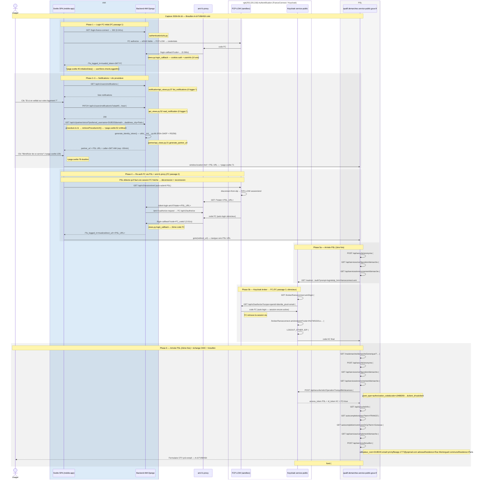

# Séquence réseau FCD — AMI staging (capture complète)

**Date de capture** : 2026-06-16 09:11–09:14  
**Utilisateur** : `avec_nom_dusage` (Pierre DUBOIS / MERCIER, ymmyffarapp-1777@yopmail.com)  
**Parcours** : Login FC → Notifications → "Et si on veillait sur votre logement ?" → Procédure → "Bénéficier de ce service" → formulaire OTV pré-rempli ✓  
**Brouillon créé** : `A-6-FV96HSII`

---

## Comment ce document a été produit

```bash
# Terminal 1 — capture réseau Playwright automatisée
cd docs/fdc-staging/tools && npm install
node capture-auto.mjs          # ouvre Chromium et rejoue le parcours automatiquement

# Terminal 2 — logs Scalingo en parallèle
scalingo --app ami-back-staging logs --follow > ../scalingo-logs.txt

# Après fin de parcours :
node correlate.mjs             # → logs-by-request/ + summary.md
```

Toutes les colonnes sauf **`Rôle (interprété)`** sont issues d'outils :
- `#`, `Méthode`, `URL`, `Statut`, `X-Request-ID` → `network.jsonl`
- `Durée` → `scalingo-logs.txt` (lignes `[router]` corrélées par `X-Request-ID`)
- `Initiator JS` → mapping statique `mapping-back.md`
- `Handler back` → grep `urls.py` + lecture `api_views.py`
- Bodies → `bodies/req-NNN-*.json`

---

## Acteurs observés dans la capture

| Acteur | Domaine | Rôle |
|--------|---------|------|
| Svelte SPA (mobile-app WebView) | `ami-back-staging.osc-fr1.scalingo.io` | Front AMI |
| Backend AMI Django | `ami-back-staging.osc-fr1.scalingo.io` | API AMI |
| **ami-fc-proxy** | `ami-fc-proxy-dev.osc-fr1.scalingo.io` | Proxy OIDC entre FranceConnect et AMI (non documenté dans fdc/ ni fdc-923/) |
| FranceConnect FCP-LOW (sandbox) | `fcp-low.sbx.dev-franceconnect.fr` | Fournisseur d'identité — 3 passages dans ce flow |
| FIP1-LOW (IdP mock FC) | `fip1-low.sbx.fcp.fournisseur-d-identite.fr` | Fournisseur d'identité de test |
| PSL front | `qualif.demarches.service-public.gouv.fr` | Front partenaire OTV |
| Keycloak service-public | `qualif.auth.service-public.gouv.fr` | SSO PSL — broker `franceconnect-ami` vers FCP-LOW |

---

## Phase 1 — Login FC initial

| # | Méthode | URL | Statut | X-Request-ID | Durée Scalingo | Handler back | **Rôle (interprété)** |
|---|---------|-----|--------|--------------|---------------|--------------|----------------------|
| 50 | HEAD | `/ping` | 200 | `5d12bb40-c334-4dca` | — | SvelteKit | fond — `franceConnectLogin()` vérifie la connectivité avant redirect |
| 51 | GET | `/login-france-connect` | 302 | `b819dae2-d606-4ead` | 0.041s | `authentication/urls.py` | **flux** — démarre le flow FC OIDC |
| 52–81 | — | redirections FC OIDC | 302–303 | n/a (FC/FIP1-LOW) | — | hors AMI | flux FC — sélection eIDAS faible, remplissage FCP-LOW, OIDC interne |
| 82 | GET | `/` (ami-fc-proxy) `?code=…` | 302 | `a528b76e-1f34-45cf` | — | ami-fc-proxy | flux — FC → proxy → AMI login-callback |
| 83 | GET | `/login-callback?code=…` | 302 | `3420f9be-6ffa-4a1a` | 0.266s | `authentication/urls.py` → `views.py:login_callback` | **flux** — AMI valide le code FC, pose cookies auth + userinfo (10 ans) |
| 84 | GET | `/?is_logged_in=true&id_token=…` | 200 | `55b38534-f519-44ae` | — | SvelteKit | **flux** — SPA reçoit le token FC, initialise `userStore` |

---

## Phase 2 — SPA AMI connectée

| # | Méthode | URL | Statut | X-Request-ID | Durée Scalingo | Handler back | **Rôle (interprété)** |
|---|---------|-----|--------|--------------|---------------|--------------|----------------------|
| 185 | GET | `/api/v1/users/notifications` | 200 | `c182024f-b68b-4fa5` | 0.487s | `notification/api_views.py:37 list_notifications` | fond — chargement liste notifications home |
| 192 × 7 | POST | `/api/v1/users/scheduled-notifications` | 200 | multiple | 48–105ms | `notification/api_views.py:95 scheduled_notifications` | fond — sync notifications programmées après login |
| 193 | GET | `/api/v1/users/notifications` | 200 | `4c03521c-cc8b-4e86` | 0.463s | idem #185 | fond — rechargement après home prête |

---

## Phase 3 — Clic notification + page procédure

| # | Méthode | URL | Statut | X-Request-ID | Durée Scalingo | Initiator JS | Handler back | **Rôle (interprété)** |
|---|---------|-----|--------|--------------|---------------|-------------|--------------|----------------------|
| 214 | PATCH | `/api/v1/users/notification/e7edad45-dc92-484e-adca-67bb9edaa066/read` | 200 | `ca8c4a7b-35ab-4a1e` | **0.088s** | `notifications.ts:72 readNotification()` | `notification/api_views.py:52 read_notification` | **flux** — marque la notification comme lue |
| 253 | GET | `/api/v1/users/notifications` | 200 | `b5635762-6abf-425d` | 0.475s | `notifications.ts:28` | idem #185 | fond — rechargement page procédure |
| 255 | GET | `/api/v1/partner/otv/url?preferred_username=DUBOIS&email=…&address_city=Paris&address_postcode=75002&address_name=Rue%20Montorgueil` | 200 | `27676f38-c0ff-407e` | **0.076s** | `procedure.ts:11 retrieveProcedureUrl()` depuis `+page.svelte:52 onMount` | `partner/api_views.py:21 generate_partner_url` → `utils/__init__.py:66 generate_identity_token()` | **flux** — génère JWT caller RS256 + URL partenaire PSL |
| 261 | GET | `/api/v1/partner/otv/url?…` (idem) | 200 | `3cbe4fcb-4493-4446` | **0.075s** | `+page.svelte:78 clickOnProcedureButton()` | idem #255 | doublon — déclenché pendant navigation sur `originalProcedureUrl` de #255 |

---

## Phase 4 — Re-authentification FC (déclenchée par PSL, via ami-fc-proxy)

> PSL reçoit `caller=JWT` et détecte qu'il faut une session FC fraîche.  
> Il démarre une déconnexion FC puis une reconnexion silencieuse via `ami-fc-proxy`.  
> Toutes les redirections sont dans `redirects.jsonl` (#264-#283).

| # | Méthode | Hôte abrégé + chemin | Statut | X-Request-ID | **Rôle (interprété)** |
|---|---------|----------------------|--------|--------------|----------------------|
| 262 | GET | `fcp-low/api/v2/session/end?id_token_hint=…` | 200 | n/a (FC) | flux — PSL déclenche fin de session FC (auto-submit JS) |
| 264 | POST | `fcp-low/api/v2/client/disconnect-from-idp` | 302 | n/a (FC) | flux — déconnexion de l'IdP FIP1-LOW |
| 265 | GET | `fip1-low/session/end?state=…` | 200 | n/a (FIP1) | flux — FIP1-LOW ferme sa session |
| 270 | POST | `fcp-low/api/v2/session/end/confirm` | 303 | n/a (FC) | flux — FC confirme déconnexion → redirige vers ami-fc-proxy |
| 271 | GET | `ami-fc-proxy/?state=<PSL_URL encodée>` | 302 | `63058665-732f-4f01` | **flux** — proxy reçoit le callback FC, redirige vers AMI silent-login |
| 272 | GET | `ami-back/silent-login-ami-fi?state=<PSL_URL>` | 302 | `4255f24d-2c7f-4182` | flux — AMI lance le flow AMI-FI silencieux |
| 273 | GET | `ami-fc-proxy/ami-fi-authorize-request/?from_url=<PSL_URL>` | 302 | n/a (proxy) | flux — proxy prépare la requête d'autorisation FC |
| 274 | GET | `fcp-low/api/v2/authorize?scope=openid+identite_pivot+…` | 302 | n/a (FC) | flux — FC démarre un nouveau flux OIDC |
| 275–276 | GET | `ami-fc-proxy/api/v1/fi/authorize/…` → `ami-back/api/v1/fi/authorize/…` | 302 | `7c48cd20`, `07e1c99d` | **flux** — module FI AMI (`ami/fi/`) reçoit la demande (0.370s) |
| 277–281 | — | redirections FC OIDC internes + ami-fc-proxy | 302–303 | n/a | flux — FC traite le code OIDC (auto-login silencieux) |
| 283 | GET | `ami-back/login-callback?code=FC_code` | 302 | `ceb8eb36-9f24-49dc` | **flux** — AMI traite le deuxième code FC (**2.011s** — authentification effective) |
| 284 | GET | `/?is_logged_in=true&redirect_url=<PSL_URL>` | 200 | `076779d9-7a8c-4d23` | **flux** — SPA re-initialisée avec redirect_url → navigue vers PSL |

---

## Phase 5a — Première arrivée PSL + session anonyme

| # | Méthode | URL | Statut | X-Request-ID | **Rôle (interprété)** |
|---|---------|-----|--------|--------------|----------------------|
| 316 | GET | `/api/v1/users/notifications` | 200 | `9991e7ce-3a25-48ae` | fond — `initializeData()` post-login recharge les notifs |
| 317 | GET | `qualif.demarches…/mademarche/demarcheGenerique/?codeDemarche=OTV&caller=JWT` | 200 | n/a (PSL) | **flux** — 1ère arrivée sur PSL avec caller JWT AMI |
| 328 | POST | `qualif.demarches…/api/securite/anonyme?codeDemarche=OperationTranquilliteVacances` | 200 | n/a (PSL) | **flux** — session anonyme PSL (token CSRF + params OIDC). Body: `{}` → token `TD: A-6-KV9J6SRR` |
| 334 | GET | `/api/services/configuration/demarche` | 200 | n/a (PSL) | flux — config démarche OTV (Bearer token anonyme) |
| 335 | GET | `/api/services/environnement/demarche` | 200 | n/a (PSL) | flux — environnement démarche |

---

## Phase 5b — Keycloak → broker FranceConnect (3ème passage FC)

> Keycloak service-public voit le paramètre `idp_hint=franceconnect-ami` et démarre  
> une authentification FC via son broker interne — **troisième passage FranceConnect** du flow.  
> FCP-LOW retrouve la session via `auto-login` sans mire visible pour l'utilisateur.

| # | Méthode | Hôte + chemin | Statut | **Rôle (interprété)** |
|---|---------|---------------|--------|----------------------|
| 337 | GET | `qualif.auth…/realms/service-public/protocol/openid-connect/auth?prompt=login&idp_hint=e1e90d50-cca0-4a85-9db3-0bcc190ee6f7` | 200 | flux — page KC auth (rendue après la boucle FC complète) |
| 347 | GET | `qualif.auth…/redirect_…/realms/service-public/…` | 307 | flux — redirect KC interne |
| 348 | GET | `qualif.auth…/realms/.../auth?prompt=login&idp_hint=…` | 303 | flux — KC décide de déléguer à `franceconnect-ami` broker |
| 349 | GET | `qualif.auth…/realms/.../broker/franceconnect-ami/login?session_code=…` | 303 | **flux** — KC redirige vers FC via broker `franceconnect-ami` |
| 350 | GET | `fcp-low/api/v2/authorize?scope=openid+identite_pivot+email&state=…` | 302 | **flux** — FC démarre un 3ème flux OIDC (silencieux) |
| 351–353 | GET | `fcp-low` redirections OIDC | 302–303 | flux — FC auto-login via session encore active |
| 354 | GET | `qualif.auth…/realms/.../broker/franceconnect-ami/endpoint?code=IHLFWGGOLxCgZFp1Or…` | 302 | **flux** — KC reçoit le code FC et l'échange contre un token KC |
| 355 | GET | `qualif.auth…/realms/.../login-actions/required-action?execution=LOGOUT_OTHER_IDP` | 302 | flux — KC gère le changement de session IDP |

---

## Phase 6 — Deuxième arrivée PSL + échange OIDC + pré-remplissage

| # | Méthode | URL | Statut | X-Request-ID | **Rôle (interprété)** |
|---|---------|-----|--------|--------------|----------------------|
| 356 | GET | `qualif.demarches…/mademarche/demarcheGenerique/?codeDemarche=OTV&caller=JWT` | 200 | n/a (PSL) | flux — 2ème chargement PSL (post KC auth complète) |
| 365 | POST | `/api/securite/anonyme?codeDemarche=OperationTranquilliteVacances` | 200 | n/a (PSL) | **flux** — nouveau token anonyme post-redirect OIDC (`TD: A-6-H0792GNN`). Body: `{}` |
| 370 | GET | `/api/services/configuration/demarche` | 200 | n/a (PSL) | flux — rechargement config (Bearer token #365) |
| 371 | GET | `/api/services/environnement/demarche` | 200 | n/a (PSL) | flux — rechargement environnement |
| **373** | POST | `/api/securite/oidc/OperationTranquilliteVacances` | **200** | n/a (PSL) | **flux** — échange du code KC (`c3488293-0855-4363-…`) contre tokens PSL. Body: `grant_type=authorization_code&code=c3488293-…&client_id=pslclient&client_secret=bidon` |
| 382 | GET | `/api/securite/info` | 200 | n/a (PSL) | **flux** — récupère l'identité authentifiée (`"nom":"DUBOIS","prenoms":"Pierre","franceConnect":true`) |
| 383 | GET | `/api/services/autocompletion/pays?term=FRANCE` | 200 | n/a (PSL) | flux — pré-remplissage : résolution pays de naissance |
| 384 | GET | `/api/services/autocompletion/communeOrCp?isCommuneHistorique=true&term=Gonesse` | 200 | n/a (PSL) | flux — pré-remplissage : résolution commune de naissance |
| 385 | GET | `/api/services/complement/demarche` | 200 | n/a (PSL) | flux — données complémentaires démarche OTV |
| **388** | POST | `/api/services/brouillon` | **200** | n/a (PSL) | **flux** — crée le brouillon pré-rempli avec données AMI. Réponse : `"A-6-FV96HSII"` |
| 394 | GET | `qualif.auth…/realms/.../login-status-iframe.html/init?client_id=pslclient` | **204** | n/a (KC) | fond — confirmation session Keycloak active (arrivé en fin de séquence) |

---

## Diagramme de séquence (flow complet)



---

## Observations factuelles (issues des outils uniquement)

| Fait | Source | Valeur |
|------|--------|--------|
| Durée `generate_partner_url` (#255) | Scalingo router log | **0.076s** |
| Durée `read_notification` (#214) | Scalingo router log | **0.088s** |
| Durée `login-callback` 1er login (#83) | Scalingo router log | **0.266s** |
| Durée `login-callback` 2ème login (#283) | Scalingo router log | **2.011s** |
| Durée `fi/authorize` (#276) | Scalingo router log | **0.370s** |
| Token anonyme PSL (#328) `TD` | `bodies/req-328-response-body.json` | `A-6-KV9J6SRR` |
| Token anonyme PSL 2ème (#365) `TD` | `bodies/req-365-response-body.json` | `A-6-H0792GNN` |
| Code KC échangé POST OIDC (#373) | `bodies/req-373-request-body.form` | `c3488293-0855-4363-9b61-4ebb7a64994c.f17209ac-…` |
| ID brouillon créé (#388) | `bodies/req-388-response-body.txt` | **`A-6-FV96HSII`** |
| Données pré-remplies brouillon (#388) | `bodies/req-388-request-body.json` | `utilisateur_nom=DUBOIS email=ymmyffarapp-1777@yopmail.com adresseResidence=Rue Montorgueil communeResidence=Paris` |
| Identité retournée par PSL (#382) | `bodies/req-382-response-body.json` | `nom=DUBOIS prenoms=Pierre commune=Gonesse pays=FRANCE franceConnect=true` |
| `logger.*` dans tous les handlers AMI | grep statique (`mapping-back.md`) | **aucun** — seuls access-logs Scalingo Router disponibles |
| Nombre passages FranceConnect | `redirects.jsonl` + `network.jsonl` | **3** (login initial + re-auth PSL + broker KC) |
| Requêtes AMI corrélées (X-Request-ID) | `summary.md` | **254** |
| Lignes logs Scalingo | `scalingo-logs.txt` | **224 lignes** |

---

## Écart avec docs/fdc-923/

| Point | fdc-923 | Cette capture |
|-------|---------|---------------|
| Passages FC | 2 (initial + re-auth PSL avec mire visible) | **3** (initial + re-auth PSL silencieuse + broker KC silencieux) |
| `ami-fc-proxy` | Non mentionné | **Présent** — broker entre FC et AMI (#271-#283) |
| Re-auth FC au clic | Mire FI visible (eIDAS faible) | **Silencieuse** via `/silent-login-ami-fi` + `ami-fi-authorize` |
| Broker KC `franceconnect-ami` | Non documenté | **Présent** (#349-#355) — KC re-demande FC avant d'émettre les tokens PSL |
| 2ème arrivée PSL | Directe après callback FC | Après le broker KC (#356 après #355) |
| Durée `login-callback` 2ème | Non documenté | **2.011s** |
| Durée `generate_partner_url` | Non documenté | **0.076s** |
