# Schéma de navigation de la webapp — ordre chronologique

Même contenu que [`schema-navigation-webapp.md`](schema-navigation-webapp.md) (mêmes pages, mêmes flèches,
mêmes marquages `✔` / `○` / `?`), mais les blocs sont rangés **dans l'ordre d'un parcours utilisateur**,
de haut en bas : connexion, accueil, onglets de la barre basse, notifications, entrées du menu Plus,
puis ce qui est hors parcours.

Fondé uniquement sur des preuves : routes et boutons observés en live sur staging le 2026-10-02 et contenu
réel des specs de `src/tests/webapp/`. Ce qui n'a pas été observé est marqué `?` (non confirmé).

La SPA navigue **uniquement par boutons** (aucun `<a href>` interne) : chaque flèche est un clic sur un bouton.

> Pour un sens de lecture gauche → droite, remplacer `flowchart TB` par `flowchart LR`.

## Schéma

```mermaid
flowchart LR
  classDef full fill:#d4f4dd,stroke:#2e7d32,color:#000
  classDef part fill:#fff3cd,stroke:#b8860b,color:#000
  classDef none fill:#eeeeee,stroke:#777,color:#000
  classDef ext fill:#ffffff,stroke:#999,stroke-dasharray:4 3,color:#555

  %% ============ 1. Connexion (1re connexion) ============
  subgraph S1["① Connexion (1re connexion)"]
    LOGIN["/login<br/>Me connecter à AMI"]:::full
    FC["FranceConnect<br/>eIDAS + mire FCP-LOW<br/>(hors SPA)"]:::ext
    PASSKEY["Clé d'accès<br/>(selon feature flag)"]:::full
    ZONES["/welcome/zones<br/>(1re connexion)"]:::full
    WNOTIF["/welcome/notifications<br/>(1re connexion)"]:::full
  end

  %% ============ 2. Accueil ============
  subgraph S2["② Accueil et barre basse"]
    HOME["Accueil /"]:::full
    PLUS{{"Menu Plus<br/>(dialogue)"}}:::full
  end

  %% ============ 3. Onglet Agenda ============
  subgraph S3["③ Onglet Agenda"]
    AGENDA["Agenda /agenda"]:::full
    AGDLG["Dialogue évènement<br/>(Supprimer)"]:::full
    ZONESP["/preferences/zones<br/>Zones scolaires (page)"]:::full
  end

  %% ============ 4. Onglet Services ============
  subgraph S4["④ Onglet Services"]
    SERVICES["Services /services<br/>2 onglets"]:::part
    CHECK["/checklist/{id}<br/>5 checklists"]:::full
    SECT["/checklist/{id}/checks/{section}/"]:::part
    OTV["/services/service/psl/<br/>OperationTranquilliteVacances"]:::part
  end

  %% ============ 5. Onglet Suivi ============
  subgraph S5["⑤ Onglet Suivi"]
    SUIVI["Suivi /followup"]:::full
    ITEM["/followup/item/…<br/>détail démarche"]:::full
    ARCH["/followup/archived"]:::part
  end

  %% ============ 6. Notifications ============
  subgraph S6["⑥ Notifications (cloche)"]
    NOTIFS["/notifications"]:::full
    PREFNOTIF["/preferences/notifications"]:::full
  end

  %% ============ 7. Menu Plus : Profil ============
  subgraph S7["⑦ Plus › Mon profil"]
    PROFILE["/profile"]:::full
    EDITU["/edit-preferred-username"]:::full
    EDITE["/edit-email"]:::full
    EDITA["/edit-address"]:::part
  end

  %% ============ 8. Menu Plus : Préférences ============
  subgraph S8["⑧ Plus › Préférences"]
    PREFS["/preferences"]:::full
    CONSENTS["/preferences/consents"]:::full
  end

  %% ============ 9. Menu Plus : Aide et contact ============
  subgraph S9["⑨ Plus › Aide et contact"]
    HELP["/help-center"]:::full
    CONTACT["/contact"]:::full
  end

  %% ============ 10. Menu Plus : pages légales ============
  subgraph S10["⑩ Plus › Pages légales"]
    LEGALD["/page/donnees-personnelles"]:::part
    LEGALA["/page/accessibilite"]:::part
  end

  %% ============ 11. Hors parcours ============
  subgraph S11["⑪ Hors parcours par bouton"]
    ERR["/network-error<br/>/technical-error<br/>/forbidden"]:::full
    PROTO["/step · /step-form<br/>/procedure-17cyber<br/>prototype ? "]:::none
    EXT["Sites externes<br/>service-public.gouv.fr<br/>demarche.numerique.gouv.fr<br/>rdv.anct.gouv.fr · annuaire<br/>partenaire de la démarche"]:::ext
  end

  %% --- Ordre vertical des blocs (liens invisibles)
  S1 ~~~ S2
  S2 ~~~ S3
  S3 ~~~ S4
  S4 ~~~ S5
  S5 ~~~ S6
  S6 ~~~ S7
  S7 ~~~ S8
  S8 ~~~ S9
  S9 ~~~ S10
  S10 ~~~ S11

  %% --- ① Connexion (spec authentication)
  LOGIN -->|"✔ S'identifier avec FranceConnect"| FC
  FC --> PASSKEY
  PASSKEY -->|"✔ Peut-être plus tard"| ZONES
  ZONES -->|"✔ Passer"| WNOTIF
  WNOTIF -->|"✔ Peut-être plus tard"| HOME

  %% --- ② Accueil et barre basse (navigation, accueil)
  HOME <-->|"✔ barre basse"| AGENDA
  HOME <-->|"✔ barre basse"| SERVICES
  HOME <-->|"✔ barre basse"| SUIVI
  HOME -->|"✔ Plus"| PLUS
  HOME -->|"✔ cloche"| NOTIFS
  HOME -->|"✔ Voir tous mes évènements"| AGENDA
  HOME -->|"✔ Voir toutes mes démarches"| SUIVI
  HOME -->|"✔ carrousel : OTV"| OTV
  HOME -->|"✔ carrousel : Renseignez votre adresse"| EDITA
  HOME -.->|"○ titre d'une démarche"| ITEM

  %% --- ③ Agenda
  AGENDA -->|"✔ évènement"| AGDLG
  AGENDA -->|"✔ Préférences"| ZONESP
  ZONESP -->|"✔ Retour"| AGENDA

  %% --- ④ Services
  SERVICES -->|"✔ checklist (onglet Aide)"| CHECK
  CHECK -->|"✔ section"| SECT
  SERVICES -->|"○ SOS, annuaire, cartes partenaires<br/>(présence testée, clic non testé)"| EXT
  SERVICES -.->|"○ carte OTV de l'onglet Démarches<br/>sort de la SPA"| EXT
  OTV -.->|"○ Bénéficier de ce service<br/>(destination ?)"| EXT

  %% --- ⑤ Suivi
  SUIVI -->|"✔ titre d'une démarche"| ITEM
  ITEM -->|"✔ Accéder à ma démarche"| EXT
  SUIVI -.->|"✔ par route seulement<br/>(chemin par bouton ?)"| ARCH
  SUIVI -.->|"○ Sous-menu (rôle ?)"| ARCH

  %% --- ⑥ Notifications
  NOTIFS -->|"✔ notification de démarche"| ITEM
  NOTIFS -->|"✔ Gérer les notifications"| PREFNOTIF

  %% --- Menu Plus (entrées, dans l'ordre du menu)
  PLUS -->|"✔ Mon profil"| PROFILE
  PLUS -->|"✔ Préférences"| PREFS
  PLUS -->|"✔ Aide et contact"| HELP
  PLUS -->|"✔ Données personnelles et sécurité"| LEGALD
  PLUS -->|"✔ Accessibilité"| LEGALA
  PLUS -->|"✔ Me déconnecter + confirmer<br/>(suppression des données)"| LOGIN

  %% --- ⑦ Profil
  PROFILE -->|"✔ Modifier (identité)"| EDITU
  PROFILE -->|"✔ Modifier (contact)"| EDITE
  PROFILE -->|"✔ Définir/Modifier l'adresse"| EDITA
  EDITU -->|"✔ Enregistrer / Annuler"| PROFILE
  EDITE -->|"✔ Enregistrer / Annuler"| PROFILE
  EDITA -.->|"✔ Annuler seulement"| PROFILE

  %% --- ⑧ Préférences
  PREFS -->|"✔ Suivi des démarches"| CONSENTS
  PREFS -->|"✔ Notifications"| PREFNOTIF
  PREFS -->|"✔ Zones scolaires"| ZONESP
  ZONESP -->|"✔ Fermer"| PREFS

  %% --- ⑨ Aide et contact
  HELP -->|"✔ Je rencontre un problème<br/>sur l'application"| CONTACT
  HELP -->|"○ aide de l'administration"| EXT
  CONTACT -->|"✔ Contacter notre équipe (dialogue)<br/>○ Faire une demande en ligne / mail"| EXT

  %% --- ⑪ Hors navigation par bouton
  ERR ~~~ PROTO
```

**Lecture** — Les blocs ①→⑪ suivent l'ordre d'un parcours : on se connecte, on arrive sur l'Accueil, on
visite les trois autres onglets, la cloche, puis les entrées du menu Plus. La déconnexion
(« Me déconnecter ») est la flèche qui revient de ② vers `/login` en ①.

**Légende** — Couleur des pages : vert = scénario qui l'atteint et vérifie son contenu ; jaune = atteinte
ou vérifiée en partie ; gris = aucun scénario ; pointillé = hors SPA.
Flèches : `✔` = clic exécuté par un scénario ; `○` = observé en live mais pas exécuté par un scénario ;
trait pointillé = lien partiel ou incertain.

La table « Quel scénario couvre quoi » et la liste « Ce qu'aucun scénario ne couvre » restent celles de
[`schema-navigation-webapp.md`](schema-navigation-webapp.md) : le contenu est identique, seul le
rangement des blocs change.