# Schéma de navigation de la webapp et couverture par les scénarios

Fondé uniquement sur des preuves : routes et boutons observés en live sur staging le 2026-10-02
(`references/website-analysis/ami-back-staging.osc-fr1.scalingo.io/website-analysis.md`) et contenu réel des
specs de `src/tests/webapp/`. Ce qui n'a pas été observé est marqué `?` (non confirmé).

La SPA navigue **uniquement par boutons** (aucun `<a href>` interne) : chaque flèche est un clic sur un bouton.

## Schéma

```mermaid
flowchart TD
  classDef full fill:#d4f4dd,stroke:#2e7d32,color:#000
  classDef part fill:#fff3cd,stroke:#b8860b,color:#000
  classDef none fill:#eeeeee,stroke:#777,color:#000
  classDef ext fill:#ffffff,stroke:#999,stroke-dasharray:4 3,color:#555

  subgraph AUTH["Connexion"]
    LOGIN["/login<br/>Me connecter à AMI"]:::full
    FC["FranceConnect<br/>eIDAS + mire FCP-LOW<br/>(hors SPA)"]:::ext
    PASSKEY["Clé d'accès<br/>(selon feature flag)"]:::full
    ZONES["/welcome/zones<br/>(1re connexion)"]:::full
    WNOTIF["/welcome/notifications<br/>(1re connexion)"]:::full
  end

  subgraph TABS["Onglets (barre basse)"]
    HOME["Accueil /"]:::full
    AGENDA["Agenda /agenda"]:::full
    SERVICES["Services /services<br/>2 onglets"]:::part
    SUIVI["Suivi /followup"]:::full
  end

  PLUS{{"Menu Plus<br/>(dialogue)"}}:::full

  subgraph PAGES["Pages enfants"]
    NOTIFS["/notifications"]:::full
    PREFNOTIF["/preferences/notifications"]:::full
    ITEM["/followup/item/…<br/>détail démarche"]:::full
    ARCH["/followup/archived"]:::part
    PROFILE["/profile"]:::full
    EDITU["/edit-preferred-username"]:::full
    EDITE["/edit-email"]:::full
    EDITA["/edit-address"]:::part
    PREFS["/preferences"]:::full
    CONSENTS["/preferences/consents"]:::full
    HELP["/help-center"]:::full
    CONTACT["/contact"]:::full
    LEGALD["/page/donnees-personnelles"]:::part
    LEGALA["/page/accessibilite"]:::part
    OTV["/services/service/psl/<br/>OperationTranquilliteVacances"]:::part
    CHECK["/checklist/{id}<br/>5 checklists"]:::full
    SECT["/checklist/{id}/checks/{section}/"]:::part
    ERR["/network-error<br/>/technical-error<br/>/forbidden"]:::full
  end

  AGDLG["Dialogue évènement<br/>(Supprimer)"]:::full
  ZDLG["Dialogue Zones scolaires"]:::part
  PROTO["/step · /step-form<br/>/procedure-17cyber<br/>prototype ? "]:::none

  EXT["Sites externes<br/>service-public.gouv.fr<br/>demarche.numerique.gouv.fr<br/>rdv.anct.gouv.fr · annuaire<br/>partenaire de la démarche"]:::ext

  %% --- Connexion (spec authentication, deconnexion)
  LOGIN -->|"✔ S'identifier avec FranceConnect"| FC
  FC --> PASSKEY
  PASSKEY -->|"✔ Peut-être plus tard"| ZONES
  ZONES -->|"✔ Passer"| WNOTIF
  WNOTIF -->|"✔ Peut-être plus tard"| HOME

  %% --- Barre basse (navigation)
  HOME <-->|"✔ barre basse"| AGENDA
  HOME <-->|"✔ barre basse"| SERVICES
  HOME <-->|"✔ barre basse"| SUIVI
  HOME -->|"✔ Plus"| PLUS

  %% --- Menu Plus
  PLUS -->|"✔ Mon profil"| PROFILE
  PLUS -->|"✔ Préférences"| PREFS
  PLUS -->|"✔ Aide et contact"| HELP
  PLUS -->|"✔ Données personnelles et sécurité"| LEGALD
  PLUS -->|"✔ Accessibilité"| LEGALA
  PLUS -->|"✔ Me déconnecter + confirmer<br/>(suppression des données)"| LOGIN

  %% --- Accueil
  HOME -->|"✔ cloche"| NOTIFS
  HOME -->|"✔ Voir tous mes évènements"| AGENDA
  HOME -->|"✔ Voir toutes mes démarches"| SUIVI
  HOME -->|"✔ carrousel : OTV"| OTV
  HOME -->|"✔ carrousel : Renseignez votre adresse"| EDITA
  HOME -.->|"○ titre d'une démarche"| ITEM

  %% --- Agenda
  AGENDA -->|"✔ évènement"| AGDLG
  AGENDA -->|"✔ Préférences"| ZDLG
  PREFS -.->|"○ Zones scolaires"| ZDLG

  %% --- Services
  SERVICES -->|"✔ checklist (onglet Aide)"| CHECK
  CHECK -->|"✔ section"| SECT
  SERVICES -->|"○ SOS, annuaire, cartes partenaires<br/>(présence testée, clic non testé)"| EXT
  SERVICES -.->|"○ carte OTV de l'onglet Démarches<br/>sort de la SPA"| EXT
  OTV -.->|"○ Bénéficier de ce service<br/>(destination ?)"| EXT

  %% --- Suivi
  SUIVI -->|"✔ titre d'une démarche"| ITEM
  ITEM -->|"✔ Accéder à ma démarche"| EXT
  SUIVI -.->|"✔ par route seulement<br/>(chemin par bouton ?)"| ARCH
  SUIVI -.->|"○ Sous-menu (rôle ?)"| ARCH

  %% --- Notifications
  NOTIFS -->|"✔ notification de démarche"| ITEM
  NOTIFS -->|"✔ Gérer les notifications"| PREFNOTIF

  %% --- Profil
  PROFILE -->|"✔ Modifier (identité)"| EDITU
  PROFILE -->|"✔ Modifier (contact)"| EDITE
  PROFILE -->|"✔ Définir/Modifier l'adresse"| EDITA
  EDITU -->|"✔ Enregistrer / Annuler"| PROFILE
  EDITE -->|"✔ Enregistrer / Annuler"| PROFILE
  EDITA -.->|"✔ Annuler seulement"| PROFILE

  %% --- Préférences
  PREFS -->|"✔ Suivi des démarches"| CONSENTS
  PREFS -->|"✔ Notifications"| PREFNOTIF

  %% --- Aide et contact
  HELP -->|"✔ Je rencontre un problème<br/>sur l'application"| CONTACT
  HELP -->|"○ aide de l'administration"| EXT
  CONTACT -->|"✔ Contacter notre équipe (dialogue)<br/>○ Faire une demande en ligne / mail"| EXT

  %% --- Hors navigation par bouton
  ERR ~~~ PROTO
```

**Légende** — Couleur des pages : vert = scénario qui l'atteint et vérifie son contenu ; jaune = atteinte
ou vérifiée en partie ; gris = aucun scénario ; pointillé = hors SPA.
Flèches : `✔` = clic exécuté par un scénario ; `○` = observé en live mais pas exécuté par un scénario ;
trait pointillé = lien partiel ou incertain.

## Quel scénario couvre quoi

| Spec (`src/tests/webapp/`) | Parcours couvert sur le schéma |
|---|---|
| `authentication.test.ts` | Connexion → FranceConnect → clé d'accès → zones → notifications → Accueil |
| `navigation.test.ts` | Barre basse (Agenda, Services, Suivi, retour Accueil) ; menu Plus : 6 entrées listées, 5 ouvertes |
| `accueil.test.ts` | Accueil → cloche, évènements, démarches, carte OTV, carte adresse (sans enregistrer) |
| `agenda.test.ts` | Agenda → dialogue évènement (Supprimer proposé, non cliqué) ; Préférences → zones |
| `services.test.ts` | Services (2 onglets, entrées présentes) → checklist → section (cases décochées) ; fiche OTV par sa route |
| `suivi.test.ts` | Cycle new/wip/closed ; Suivi → détail (historique) → lien partenaire ; archivées **par route** |
| `notifications.test.ts` | Réception inbox ; notification de démarche → détail ; Gérer → préférences de notifications |
| `profil.test.ts` | Profil → 3 formulaires (Annuler) ; modification nom d'usage et email puis restauration |
| `preferences.test.ts` | Préférences → consentements (partenaires, AMI coché) ; notifications (case présente) |
| `aide-contact.test.ts` | Aide → Contact → dialogue ; pages légales : sections listées (non ouvertes) |
| `deconnexion.test.ts` | Plus → Me déconnecter → confirmation → connexion → reconnexion, données d'origine |
| `erreurs.test.ts` | Les 3 pages d'erreur, par leur route |

## Ce qu'aucun scénario ne couvre

- Clic sur les entrées SOS, l'annuaire et les cartes partenaires de Services (leur présence est testée, pas leur destination) ;
- « Bénéficier de ce service », « Accéder à l'annuaire », « Faire une demande en ligne », « Envoyer un mail » ;
- cases d'une checklist (cocher/décocher) et ouverture d'une section de page légale ;
- « Zones scolaires » depuis Préférences (testé seulement depuis l'Agenda), changement réel de zones ;
- actions « Supprimer » (agenda) et « Archiver » (suivi), « Tout suivre », activation des notifications ;
- chemin par bouton vers `/followup/archived`, rôle du bouton « Sous-menu » ;
- enregistrement d'une adresse (`/edit-address`, volontairement écarté comme dans la suite mobile) ;
- pages de prototype `/step`, `/step-form`, `/procedure-17cyber`.
