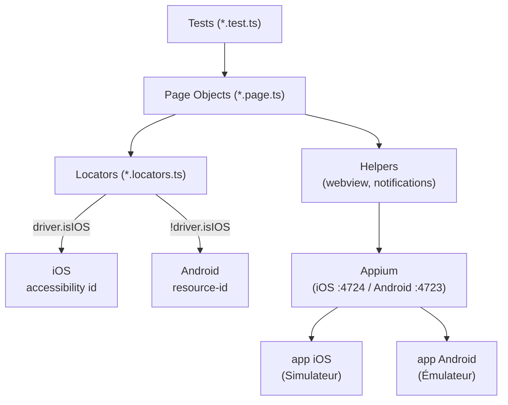
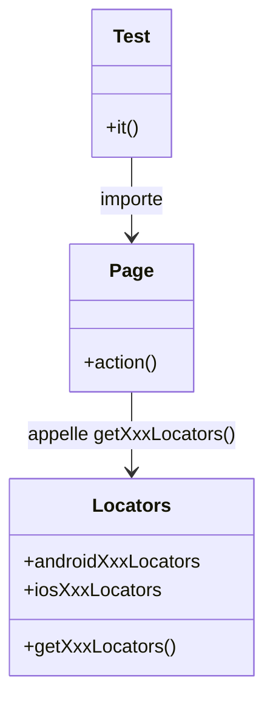
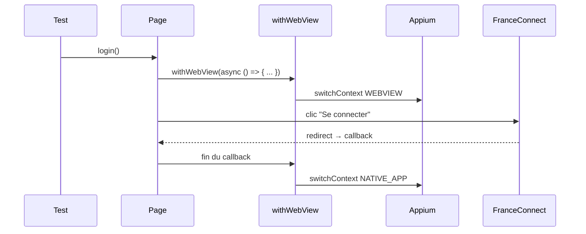

## Vue d'ensemble

```mermaid
graph TD
    Tests["Tests (*.test.ts)"] --> Pages["Page Objects (*.page.ts)"]
    Pages --> Locators["Locators (*.locators.ts)"]
    Locators -->|driver.isIOS| iOS["iOS\naccessibility id"]
    Locators -->|"!driver.isIOS"| Android["Android\nresource-id"]
    Pages --> Helpers["Helpers\n(webview, notifications)"]
    Helpers --> Appium["Appium\n(iOS :4724 / Android :4723)"]
    Appium --> AppIOS["app iOS\n(Simulateur)"]
    Appium --> AppAndroid["app Android\n(Émulateur)"]
```

## Pattern Page Object (POM 3 niveaux)

```mermaid
classDiagram
    class Test {
        +it()
    }
    class Page {
        +action()
    }
    class Locators {
        +androidXxxLocators
        +iosXxxLocators
        +getXxxLocators()
    }
    Test --> Page : importe
    Page --> Locators : appelle getXxxLocators()
```

## Flux d'authentification FranceConnect

```mermaid
sequenceDiagram
    participant Test
    participant Page
    participant withWebView
    participant Appium
    participant FranceConnect

    Test->>Page: login()
    Page->>withWebView: withWebView(async () => { ... })
    withWebView->>Appium: switchContext WEBVIEW
    Page->>FranceConnect: clic "Se connecter"
    FranceConnect-->>Page: redirect → callback
    Page->>withWebView: fin du callback
    withWebView->>Appium: switchContext NATIVE_APP
```
