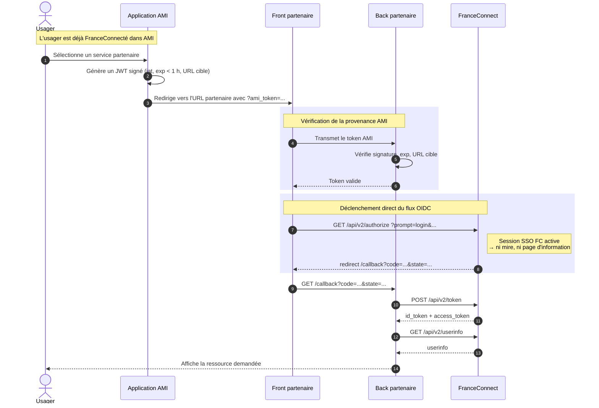
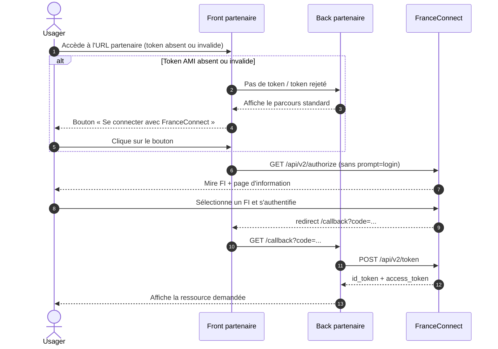

# Intégration partenaire — FranceConnexion Direct

> Statut : **brouillon, à relire avant diffusion partenaire**
> Dernière mise à jour : 9 juin 2026
> Public visé : équipes techniques d'un fournisseur de service partenaire d'AMI, déjà raccordé à FranceConnect.

## 1. Présentation

### Qu'est-ce que la FranceConnexion Direct (FCD) ?

La FranceConnexion Direct est une optimisation du parcours d'authentification lorsqu'un usager rebondit depuis l'application AMI vers votre service.
Elle permet de **lui éviter de revoir** :

- le bouton bleu « Se connecter avec FranceConnect »,
- la mire de sélection du fournisseur d'identité (FI),
- la page d'information et de consentement FranceConnect, vu qu'il a déjà consenti avec la connexion à AMI.

AMI fait une reconnexion silencieuse pour permettre à l'utilisateur d'[avoir une session déjà active](https://docs.partenaires.franceconnect.gouv.fr/fs/fs-technique/fs-technique-sessions/) sur votre service (les sessions FC d'environ 30 minutes).
L'usager est ainsi reconnecté de manière fluide sur votre site, alors qu'on vient de le réauthentifier dans AMI.

### Pré-requis

- Vous êtes déjà fournisseur de service FranceConnect et savez déclencher un flux OIDC standard (`/api/v2/authorize`).
- Vous disposez d'un canal de contact avec l'équipe AMI pour :
	- échanger les **certificats** nécessaires à la vérification des JWT émis par AMI.
	- fournir l'ensemble des consentements nécéssaires à l'utilisation de votre service pour que nous puissions l'inclure en amont lors de la FranceConnexion à AMI.
	- \[Facultatif] obtenir un compte partenaire auprès d'AMI pour envoyer des notifications, si vous souhaitez tester vous-même votre intégration,
- Vous devrez obtenir l'**autorisation FranceConnect** d'utiliser le paramètre `prompt=login` (démarche administrative, à anticiper).

## 2. Principe de fonctionnement

La FCD repose sur trois éléments :

1. **Court-circuiter le bouton FranceConnect.** Côté front, au lieu d'afficher le bouton bleu et d'attendre un clic, votre application déclenche directement la redirection vers FranceConnect (équivalent à un clic simulé en JavaScript, ou à un `redirect` HTTP côté serveur).

2. **Demander à FranceConnect de sauter la mire et la page d'information.** L'appel à `/api/v2/authorize` inclut le paramètre OIDC standard `prompt=login`.

3. **Vérifier que l'appel vient bien d'AMI.** Sans ce contrôle, n'importe quel site pourrait abuser de votre intégration FCD pour rediriger vers FranceConnect en court-circuitant la page d'information. Voir la section 3.

### Autorisation administrative préalable

Le paramètre `prompt=login` ne peut être utilisé que si FranceConnect l'a autorisé pour votre service. Cette autorisation se demande à l'équipe France Connect.
**Anticipez cette étape** : elle est purement administrative, mais elle peut prendre plusieurs semaines (un déploiement de FC) en attendant qu'ils aient une interface d'administration ad-hoc.

Pour qu'AMI puisse connecter vos usagers à votre service directement, ils doivent avoir donné leur consentement lors de la connexion à FC depuis AMI.
Vous devez donc nous fournir toutes les informations de consentement nécessaire à l'utilisation de votre service pour que nous puissions l'intégrer à AMI.
**Anticipez aussi cette étape** : elle est purement administrative, mais elle peut prendre plusieurs jours.

## 3. Prouver que la requête vient d'AMI

### Pourquoi cette preuve

La FCD raccourcit le parcours utilisateur en faisant l'hypothèse que la session SSO FranceConnect est active.
Si n'importe quel site pouvait déclencher ce raccourci, un attaquant pourrait orchestrer un parcours détourné.
Vous devez donc vérifier que l'appel entrant provient effectivement d'AMI.

### Solution retenue : JWT signé, courte durée de validité

AMI vous transmet, en paramètre de l'URL d'entrée chez vous, un **JSON Web Token signé** avec son certificat.
Vous le vérifiez avec la clé publique correspondante.

Caractéristiques du token :

- **Signature** par la clé privée AMI (algorithme à fixer lors de l'échange initial — par défaut `RS256`).
- **Durée de validité courte** : strictement inférieure à 1 heure. La valeur précise sera fixée d'un commun accord à l'intégration.
- **Charge utile minimale** : date d'émission (`iat`), date d'expiration (`exp`), URL de destination, identifiant émetteur (`iss = "ami"`).
- **Aucune donnée métier** dans ce token. Le préremplissage utilise un mécanisme distinct (token chiffré avec votre clé publique, hors périmètre de ce document).

### Côté partenaire : ce que vous devez faire

1. Récupérer et stocker le **certificat public** AMI (modalités d'échange et de rotation à convenir).
2. Sur votre route d'entrée FCD, vérifier :
	- la **signature** du JWT,
	- la **date d'expiration** (`exp`) — rejeter si expiré,
	- l'**URL de destination** — rejeter si elle ne correspond pas à la route appelée.
3. En cas d'échec d'une de ces vérifications, basculer sur le **parcours OIDC standard** (afficher le bouton FranceConnect — voir Diagramme B).

## 4. Diagrammes de séquence

### Diagramme A — FCD nominale

Cas où l'usager vient juste de s'authentifier dans AMI : la session SSO FranceConnect est active, et il est redirigé chez vous sans nouvelle interaction d'authentification.

### Diagramme B — Fallback (token AMI absent ou invalide)

La FCD est une **optimisation**. Votre service doit rester fonctionnel si la FCD échoue : token AMI absent, expiré ou mal signé.

## 5. Étapes d'intégration côté partenaire

1. **Demander l'autorisation FranceConnect** pour le paramètre `prompt=login`.
	1. Vous devez nous fournir l'ensemble des consentements nécéssaires à l'utilisation de votre service pour que nous puissions l'inclure en amont lors de la FranceConnexion à AMI.
	2. Cela nous permet de fournir une connexion directe à votre service sans page intermédiaire ni attente sur cette page.
2. **Échanger les certificats** avec l'équipe AMI (récupération du certificat public AMI pour vérifier les JWT).
3. **Implémenter la vérification du JWT** sur votre route d'entrée (signature, expiration, URL de destination).
4. **Adapter votre déclenchement OIDC** :
	- court-circuiter l'affichage du bouton FranceConnect lorsque le token AMI est valide,
	- ajouter le paramètre `prompt=login` à l'appel `/api/v2/authorize`.
5. **Conserver le parcours OIDC standard** comme fallback (Diagramme B).
6. **Tester de bout en bout** (voir section 6).

## 6. Vérification de bout en bout

Procédure de validation manuelle reproductible.

### Pré-requis

- Un [compte de test FC - AMI (sandbox)](https://github.com/france-connect/sources/blob/main/docker/volumes/fcp-low/mocks/idp/databases/citizen/base.csv).
- Un accès à votre service partenaire raccordé à FranceConnect.
- Un navigateur avec outils de développement (onglet *Réseau*).
- Un compte partenaire fourni par AMI, voire un compte ProConnect pour l'UI d'administration d'AMI

### Procédure

#### Procédure simple

L'équipe AMI envoie à un compte de test, un avec un lien vers la démarche partenaire de test.
Le partenaire peut se connecter au compte de test, y consulter la notification envoyé par AMI et cliquer dessus pour être redirigé vers le site partenaire de test.

#### Procédure par API

Procédure technique sans authentification ni intervention de l'équipe AMI
>*EGV Proposition* Accessible uniquement aux partenaires ayant intégré le service de notifications sur AMI. Dans le cas contraire, l'équipe AMI pourra envoyer à l'un compte de test un avec un lien vers la démarche partenaire, pour test.

1. Se connecter à AMI avec le compte de test FC.
2. Déclencher l'accès à une ressource de votre service depuis AMI via une notification:
	1. en utilisant le swagger de qualification ou sur l'environnement staging: https://ami-back-staging.osc-fr1.scalingo.io/schema/rapidoc#post-/api/v1/notifications
		1. Le basic auth requis est celui du compte partenaire
		2. en utilisant la vue "multi-form data" vous aurez une documentation de chaque champ, dont :
			1. recipient_fc_hash: que l'on peut copier depuis l'application mobile, en étant connecté au compte de test, cliquer sur votre avatar en haut à gauche, puis "préférences", et "nous contacter". Cette page vous affichera un identifiant copiable.
			2. content_title: un titre de notification
			3. content_body: un contenu pour votre notification
			4. item_external_url: un lien vers une page authentifiée de votre service
			5. send_date: votre date d'envoi au format ISO 8601 (2026-06-09T14:30:00+02:00 ou 2026-06-09)
			6. enfin try_push à false précise que l'on ne veut pas notifier les appareils, a true ou par défaut, nous notifions.
3. Ouvrir les outils de développement avant la redirection vers FranceConnect.
4. Repérer l'appel sortant vers `/api/v2/authorize` et vérifier la présence du paramètre **`prompt=login`** dans la query string.

#### Procédure par UI admin

Procédure par site web administration avec une création de compte par l'équipe AMI à chaque redéploiement de l'environnement AMI que vous utiliserez.
>*EGV Proposition* Accessible uniquement aux partenaires ayant intégré le service de notifications sur AMI.

1. Se connecter à AMI avec le compte de test.
2. Déclencher l'accès à une ressource de votre service depuis AMI via une notification :
	1. [En demandant à l'équipe AMI de promouvoir votre email ProConnect en admin] (https://github.com/numerique-gouv/ami-notifications-api/blob/main/CONTRIBUTING.md#agent-admin-space-espace-partenaire-ami)
	2. En vous connectant à l'espace partenaire de AMI: en staging: https://ami-back-staging.osc-fr1.scalingo.io/agent-admin/manage/notification/
	3. En allant sur la page "Envoyer une notification", vous pourrez remplir partiellement le formulaire avec, au minimum, les champs suivants (ceux suivis d'une étoile *) :
		1. recipient_fc_hash: que l'on peut copier depuis l'application mobile, en étant connecté au compte de test, puis paramètres, à propos, contact qui vous affichera un identifiant ou un moyen de conact (mail ou autre) qui contiendra cet identifiant.
		2. content_title: un titre de notification
		3. content_body: un contenu pour votre notification
		4. item_external_url: un lien vers une page authentifiée de votre service
		5. send_date: votre date d'envoi au format ISO 8601 (2026-06-09T14:30:00+02:00 ou 2026-06-09)
		6. enfin try_push à false précise que l'on ne veux pas notifier les appareils, a true ou par défaut, nous notifions.
3. Ouvrir les outils de développement avant la redirection vers FranceConnect.
4. Repérer l'appel sortant vers `/api/v2/authorize` et vérifier la présence du paramètre **`prompt=login`** dans la query string.

### Critères de succès

- L'usager arrive sur la ressource attendue **sans voir** :
	- la mire de choix du FI,
	- la page d'information FranceConnect.
- L'appel à `/api/v2/authorize` contient bien `prompt=login`.
- Si vous retirez ou altérez le token AMI dans l'URL d'entrée, le parcours **bascule sur le flux standard** (bouton FranceConnect affiché).

## 7. Annexes

### 7.1 Glossaire

| Terme | Définition |
|---|---|
| **FCD** | FranceConnexion Direct — l'objet de ce document. |
| **FI** | Fournisseur d'Identité (La Poste, Ameli, Impôts…). |
| **FS** | Fournisseur de Service — votre service, raccordé à FranceConnect. |
| **AMI-FI** | Fournisseur d'identité exposé par l'application AMI elle-même, utilisé pour la reconnexion silencieuse au sein d'AMI. |
| **Mire FI** | Page FranceConnect listant les fournisseurs d'identité disponibles. |
| **Page d'information** | Page FranceConnect précisant les données qui vont être transmises au FS avant consentement. |
| **SSO FranceConnect** | Session ouverte chez FranceConnect (~30 minutes) permettant de ne pas se réauthentifier entre deux FS. |
| **`prompt=login`** | Paramètre OIDC standard demandant à FranceConnect de ne pas afficher la page d'information. Soumis à autorisation. |
| **JWT** | JSON Web Token — format compact de jeton signé (RFC 7519). |

### 7.2 Limitations connues

- L'environnement **staging d'AMI n'est accessible qu'aux IP déclarées**. Pour les premiers tests, prévoir une bascule sur la prod avec parcimonie.
- Les modalités précises de **cycle de vie des certificats** (échange, rotation, révocation) ne sont pas encore documentées. Elles seront ajoutées en annexe avant mise en production.
- La FCD est **autorisée par FranceConnect au cas par cas** : tant que l'autorisation n'est pas posée, l'appel `prompt=login` sera rejeté par FranceConnect.

### 7.3 Références

- [Document d'architecture technique AMI](https://github.com/numerique-gouv/ami-dat), notamment :
	- *Interconnexions* (`content/3.5. Interconnexions.md`)
	- *Chiffrement des données en transit et au repos* (`content/4.1.…md`)
- [Spécification OIDC `prompt`](https://openid.net/specs/openid-connect-core-1_0.html#AuthRequest)
- [Patterns de micro services](https://microservices.io/post/architecture/2025/07/22/microservices-authn-authz-part-3-jwt-authorization.html)
- [l'OIDC chez FranceConnect](https://docs.partenaires.franceconnect.gouv.fr/fs/fs-technique/fs-technique-oidc/)
- [Besoin d'intégrations partenaires](https://docs.numerique.gouv.fr/docs/d47bae28-71cc-4b62-9e84-bd7027d6e462/)
- [Envoi de notifications individuelles par API](https://ami-back-staging.osc-fr1.scalingo.io/schema/rapidoc#post-/api/v1/notifications) en vue multi-form-data pour avoir une documentation de chaque champs.
- [Envoi de notifications individuelles par l'espace web partenaire](https://ami-back-staging.osc-fr1.scalingo.io/agent-admin/manage/notification/)
