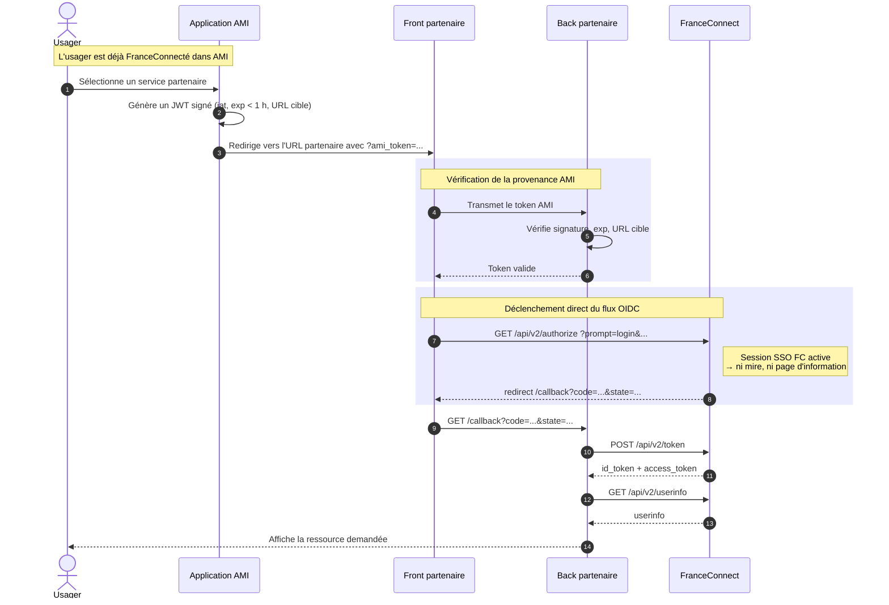
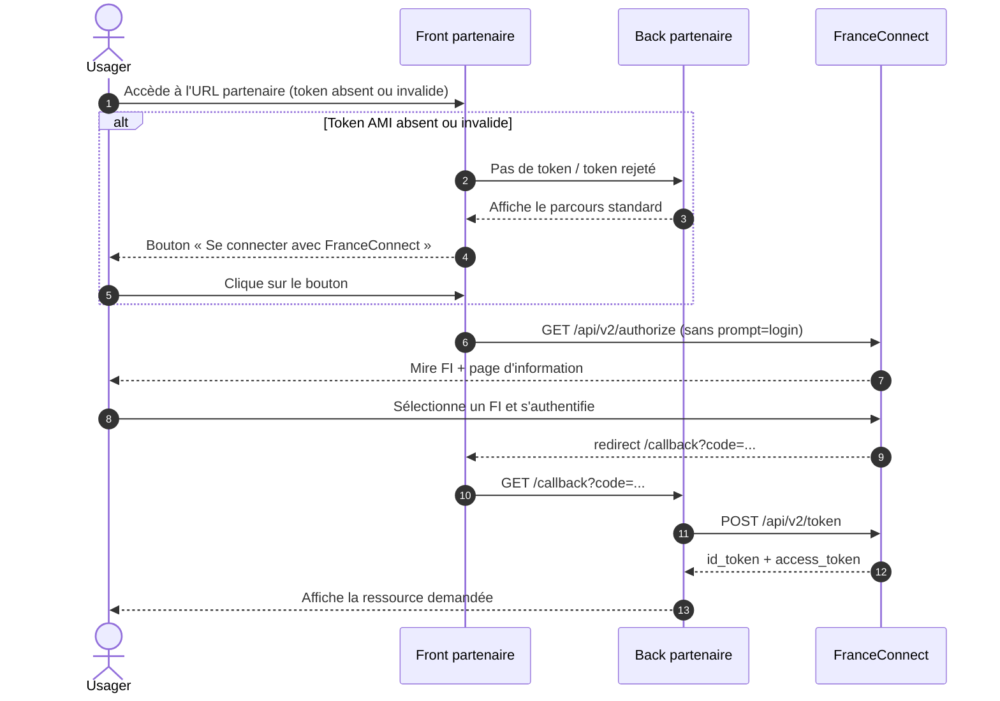

# Intégration partenaire — FranceConnexion Direct

> Statut : **brouillon — à relire avant diffusion partenaire**
> Dernière mise à jour : 8 juin 2026
> Public visé : équipes techniques d'un fournisseur de service partenaire d'AMI, déjà raccordé à FranceConnect.

## 1. Présentation

### Qu'est-ce que la FranceConnexion Direct (FCD) ?

La FranceConnexion Direct est une optimisation du parcours d'authentification lorsqu'un usager rebondit depuis l'application AMI vers votre service. Elle permet de **lui éviter de revoir** :

- le bouton bleu « Se connecter avec FranceConnect »,
- la mire de sélection du fournisseur d'identité (FI),
- la page d'information et de consentement FranceConnect.

L'usager est ainsi reconnecté de manière fluide sur votre site, alors qu'il vient déjà de s'authentifier dans AMI.

### Ce que ce document couvre — et ce qu'il ne couvre pas

Ce document décrit **uniquement** l'authentification fluide (FCD).

Il **ne décrit pas** le service de **préremplissage** (transmission de données métier signées et chiffrées entre AMI et votre back). Le préremplissage fera l'objet d'un document séparé.

Cette séparation est volontaire : dans les premières intégrations (DILA/PSL), les deux services avaient été mélangés dans un même token, ce qui a complexifié inutilement l'intégration. Vous pouvez implémenter la FCD **sans** implémenter le préremplissage, et inversement.

### Pré-requis

- Vous êtes déjà fournisseur de service FranceConnect et savez déclencher un flux OIDC standard (`/api/v2/authorize`).
- Vous disposez d'un canal de contact avec l'équipe AMI pour :
  - obtenir l'**autorisation FranceConnect** d'utiliser le paramètre `prompt=login` (démarche administrative, à anticiper),
  - échanger les **certificats** nécessaires à la vérification des JWT émis par AMI.

## 2. Principe de fonctionnement

La FCD repose sur trois éléments :

1. **Court-circuiter le bouton FranceConnect.** Côté front, au lieu d'afficher le bouton bleu et d'attendre un clic, votre application déclenche directement la redirection vers FranceConnect (équivalent à un clic simulé en JavaScript, ou à un `redirect` HTTP côté serveur).

2. **Demander à FranceConnect de sauter la mire et la page d'information.** L'appel à `/api/v2/authorize` inclut le paramètre OIDC standard `prompt=login`.

3. **Vérifier que l'appel vient bien d'AMI.** Sans ce contrôle, n'importe quel site pourrait abuser de votre intégration FCD pour rediriger vers FranceConnect en court-circuitant la page d'information. Voir la section 3.

### À propos du paramètre `idp_hint`

Vous pourrez voir dans certaines intégrations historiques (notamment la PSL de la DILA) le paramètre `idp_hint=AMI-FI`. Il forçait l'utilisation d'AMI-FI comme fournisseur d'identité.

**Vous n'avez pas à l'implémenter.** L'expérience a montré qu'il n'apporte rien dans ce sens (AMI → partenaire) et il sera progressivement retiré. Seul `prompt=login` est nécessaire.

### Autorisation administrative préalable

Le paramètre `prompt=login` ne peut être utilisé que si FranceConnect l'a autorisé pour votre service. Cette autorisation se demande à l'équipe AMI, qui la relaie auprès de FranceConnect. **Anticipez cette étape** : elle est purement administrative, mais elle peut prendre plusieurs jours.

## 3. Prouver que la requête vient d'AMI

### Pourquoi cette preuve

La FCD raccourcit le parcours utilisateur en faisant l'hypothèse que la session SSO FranceConnect est active. Si n'importe quel site pouvait déclencher ce raccourci, un attaquant pourrait orchestrer un parcours détourné. Vous devez donc vérifier que l'appel entrant provient effectivement d'AMI.

### Solution retenue : JWT signé, courte durée de validité

AMI vous transmet, en paramètre de l'URL d'entrée chez vous, un **JSON Web Token signé** avec son certificat. Vous le vérifiez avec la clé publique correspondante.

Caractéristiques du token :

- **Signature** par la clé privée AMI (algorithme à fixer lors de l'échange initial — par défaut `RS256`).
- **Durée de validité courte** : strictement inférieure à 1 heure. La valeur précise sera fixée d'un commun accord à l'intégration.
- **Charge utile minimale** : date d'émission (`iat`), date d'expiration (`exp`), URL de destination, identifiant émetteur (`iss = "ami"`).
- **Aucune donnée métier** dans ce token. Le préremplissage utilise un mécanisme distinct (token chiffré avec votre clé publique, hors périmètre de ce document).

### Côté partenaire : ce que vous devez faire

1. Récupérer et stocker le **certificat public** AMI (modalités d'échange et de rotation à convenir).
2. Sur votre route d'entrée FCD, vérifier :
   - la **signature** du JWT,
   - la **date d'expiration** (`exp`) — rejeter si expiré,
   - l'**URL de destination** — rejeter si elle ne correspond pas à la route appelée.
3. En cas d'échec d'une de ces vérifications, basculer sur le **parcours OIDC standard** (afficher le bouton FranceConnect — voir Diagramme B).

### Alternatives évaluées et écartées

| Option | Raison de l'écart |
|---|---|
| En-tête HTTP `Referer` | Trop facilement falsifiable ou absent (politiques `Referrer-Policy`). |
| TLS mutuel (mTLS) | Trop complexe à industrialiser sur les 50 partenaires visés à 2 ans. |
| Authentification inter-applications réseau | Pertinent en intra-SI, mais non transposable à un écosystème de partenaires hétérogènes. |

### Point ouvert (à signaler honnêtement)

Les modalités de **génération, rotation, révocation et traçabilité** des certificats AMI sont en cours de définition. Elles seront précisées dans une annexe dédiée avant la mise en production de votre intégration.

## 4. Diagrammes de séquence

### Diagramme A — FCD nominale

Cas où l'usager vient juste de s'authentifier dans AMI : la session SSO FranceConnect est active, et il est redirigé chez vous sans nouvelle interaction d'authentification.

### Diagramme B — Fallback (session FC expirée ou token AMI invalide)

La FCD est une **optimisation**. Votre service doit rester fonctionnel si la FCD échoue : token AMI absent, expiré, mal signé, ou session SSO FranceConnect expirée côté FranceConnect.

## 5. Étapes d'intégration côté partenaire

1. **Demander l'autorisation FranceConnect** pour le paramètre `prompt=login`, via l'équipe AMI.
2. **Échanger les certificats** avec l'équipe AMI (récupération du certificat public AMI pour vérifier les JWT).
3. **Implémenter la vérification du JWT** sur votre route d'entrée (signature, expiration, URL de destination).
4. **Adapter votre déclenchement OIDC** :
   - court-circuiter l'affichage du bouton FranceConnect lorsque le token AMI est valide,
   - ajouter le paramètre `prompt=login` à l'appel `/api/v2/authorize`.
5. **Conserver le parcours OIDC standard** comme fallback (Diagramme B).
6. **Tester de bout en bout** (voir section 6).

## 6. Vérification de bout en bout

Procédure de validation manuelle reproductible (procédure dérivée d'un débogage live mené avec l'équipe AMI le 8 juin 2026).

### Pré-requis

- Un compte de test AMI (à demander à l'équipe AMI).
- Un accès à votre service partenaire raccordé à FranceConnect.
- Un navigateur avec outils de développement (onglet *Réseau*).

### Procédure

1. Se connecter à AMI avec le compte de test.
2. Déclencher l'accès à une ressource de votre service depuis AMI (par exemple depuis la liste des procédures ou via une notification).
3. Ouvrir les outils de développement avant la redirection vers FranceConnect.
4. Repérer l'appel sortant vers `/api/v2/authorize` et vérifier la présence du paramètre **`prompt=login`** dans la query string.

### Critères de succès

- L'usager arrive sur la ressource attendue **sans voir** :
  - la mire de choix du FI,
  - la page d'information FranceConnect.
- L'appel à `/api/v2/authorize` contient bien `prompt=login`.
- Si vous retirez ou altérez le token AMI dans l'URL d'entrée, le parcours **bascule sur le flux standard** (bouton FranceConnect affiché).

### Test E2E associé

Le backlog des tests end-to-end inclut deux scénarios à valider côté AMI :

- *« Partenaire qui implémente la FranceConnexion directe → l'usager n'est pas reconfronté à la page d'information FranceConnect »*
- *« Partenaire qui n'implémente pas la FranceConnexion directe → le parcours FranceConnect standard fonctionne quand même »*

Voir `webdriverio/docs/parcours_partenaires.md`, section 2.3.

## 7. Annexes

### 7.1 Glossaire

| Terme | Définition |
|---|---|
| **FCD** | FranceConnexion Direct — l'objet de ce document. |
| **FI** | Fournisseur d'Identité (La Poste, Ameli, Impôts…). |
| **FS** | Fournisseur de Service — votre service, raccordé à FranceConnect. |
| **AMI-FI** | Fournisseur d'identité exposé par l'application AMI elle-même, utilisé pour la reconnexion silencieuse au sein d'AMI. |
| **Mire FI** | Page FranceConnect listant les fournisseurs d'identité disponibles. |
| **Page d'information** | Page FranceConnect précisant les données qui vont être transmises au FS avant consentement. |
| **SSO FranceConnect** | Session ouverte chez FranceConnect (~30 minutes) permettant de ne pas se réauthentifier entre deux FS. |
| **`prompt=login`** | Paramètre OIDC standard demandant à FranceConnect de ne pas afficher la page d'information. Soumis à autorisation. |
| **JWT** | JSON Web Token — format compact de jeton signé (RFC 7519). |

### 7.2 Limitations connues

- L'environnement **staging d'AMI n'est accessible qu'aux IP déclarées**. Pour les premiers tests, prévoir une bascule sur la prod avec parcimonie.
- Les modalités précises de **cycle de vie des certificats** (échange, rotation, révocation) ne sont pas encore documentées. Elles seront ajoutées en annexe avant mise en production.
- La FCD est **autorisée par FranceConnect au cas par cas** : tant que l'autorisation n'est pas posée, l'appel `prompt=login` sera rejeté par FranceConnect.

### 7.3 Contacts

| Pour | Contact |
|---|---|
| Autorisation FranceConnect (`prompt=login`) | Équipe AMI |
| Échange et rotation des certificats | Équipe AMI |
| Questions techniques d'intégration | Équipe AMI |

### 7.4 Références

- Backlog E2E partenaires : `webdriverio/docs/parcours_partenaires.md`
- Document d'architecture technique AMI (`ami-dat/`), notamment :
  - *Interconnexions* (`content/3.5. Interconnexions.md`)
  - *Chiffrement des données en transit et au repos* (`content/4.1.…md`)
- Spécification OIDC `prompt` : <https://openid.net/specs/openid-connect-core-1_0.html#AuthRequest>
